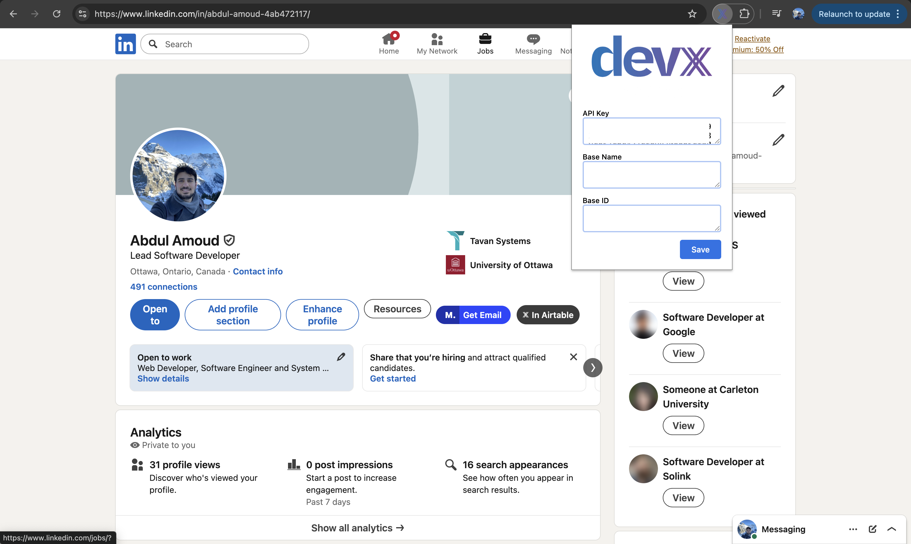

# DevX Staffing's LinkedIn x Airtable Chrome Extension

This extension will check if they LinkedIn profile you're visiting is in your Airtable Base. If not a button will render in the profile's action bar that will add the profile to your Airtable Base.

## Installation

1. Download the extension here [https://github.com/abdu997/devx-linkedin-airtable-chrome-ext/archive/refs/heads/main.zip](https://github.com/abdu997/devx-linkedin-airtable-chrome-ext/archive/refs/heads/main.zip)
2. Unzip the folder
3. Navigate to chrome://extensions in your Chrome Browser
4. Toggle “Developer Mode”
5. Click “Load Unpacked”
6. Choose the unzipped folder from step #2
7. Naviagte to a LinkedIn profile

## Settings

**Click on the extension icon in your browser’s extension bar. Then, enter your Airtable API key, base name, and base ID.**

* **API Key:** Go to [https://airtable.com/create/tokens](https://airtable.com/create/tokens) and generate a personal access token. Make sure it has **read and write permissions** on the records in your workspace.
* **Base Name:** This is the name of the base as it appears in your Airtable dashboard (e.g., “Local Talent”).
* **Base ID:** To find the base ID, visit [https://airtable.com/api](https://airtable.com/api), select your base, and copy the ID that starts with **app** from the URL or top of the documentation page (e.g., **appAzft2IyOUVJ0ZQ**).
